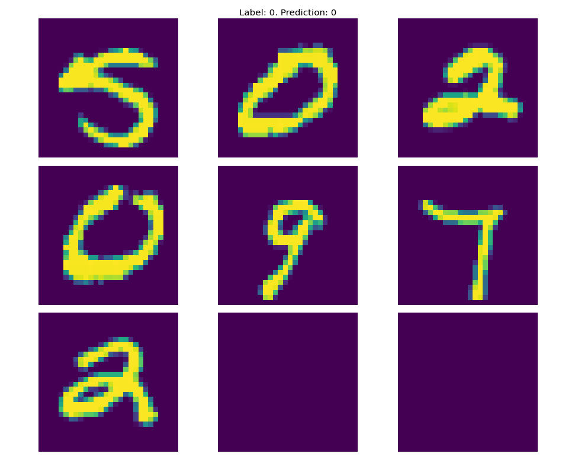
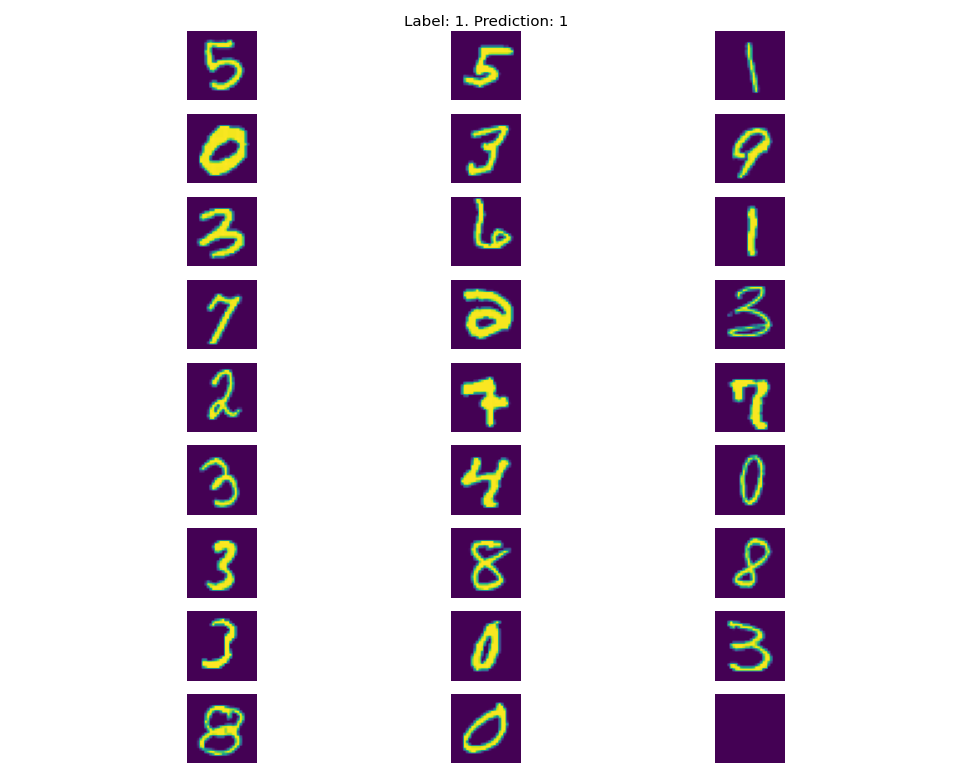
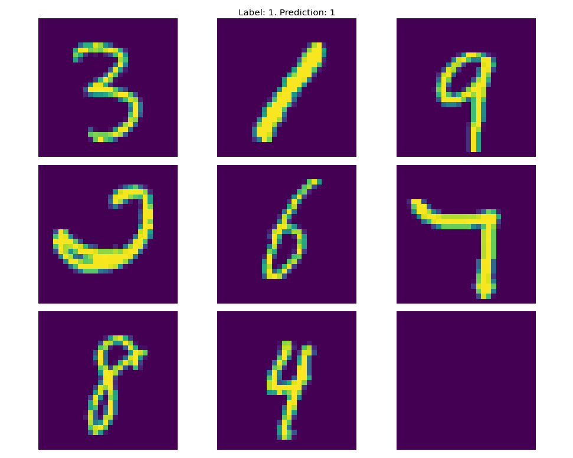

### Sequence classification task

A crtitical part of the task was considered a pipeline organization, once this is established, other model architectures might be explored.

As of now ResNet34 architecture is chosen as a baseline. The standart achitecture is modified with 30 input channels and one output channel. The dataset is written as well to have 30-channel input, first channels of which are filled with chosen images. All parameters are specified in settings.py file.

#### To run the pipeline

Create an environment and install dependacies.
```
conda create -n envname python=3.8
conda activate envname
pip install -r requirements.txt
```

Modify `settings.py` file if needed. Once done, you can run training pipeline.
```
python train.py
```

Once training is over, results are easily visualized using jupyter notebook 'results_visualization.ipynb'



